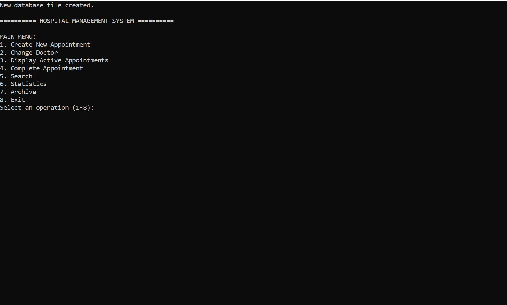
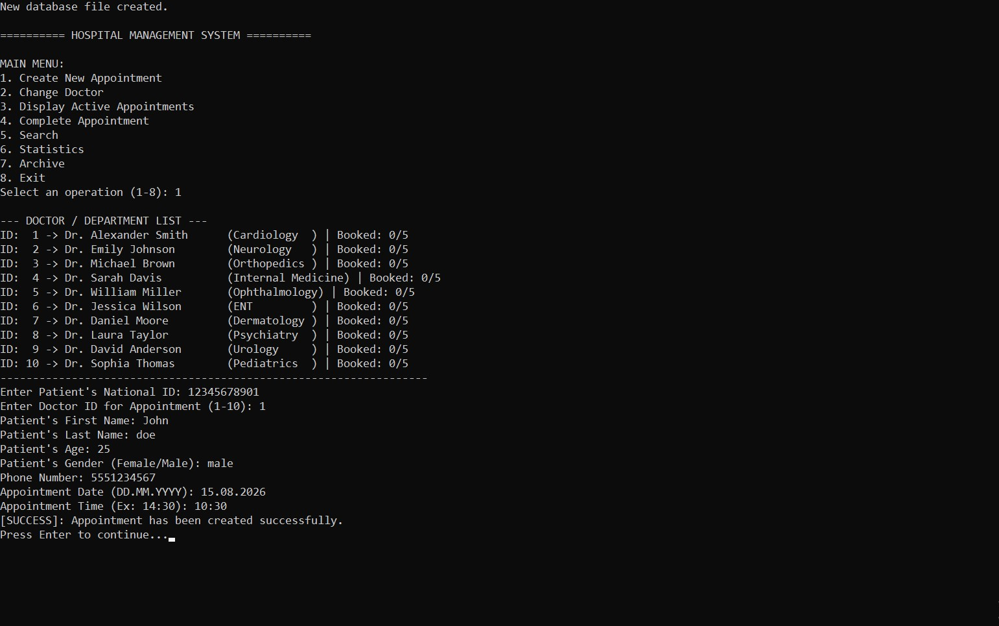
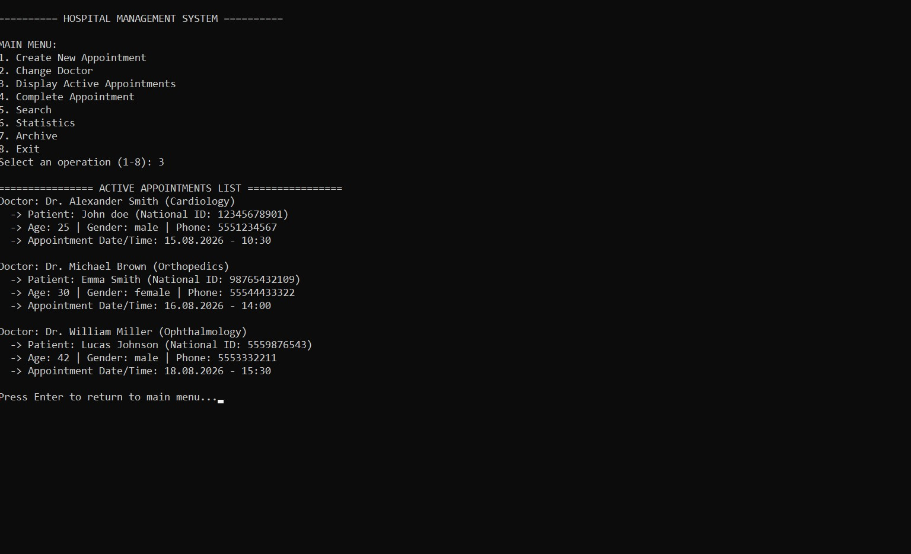
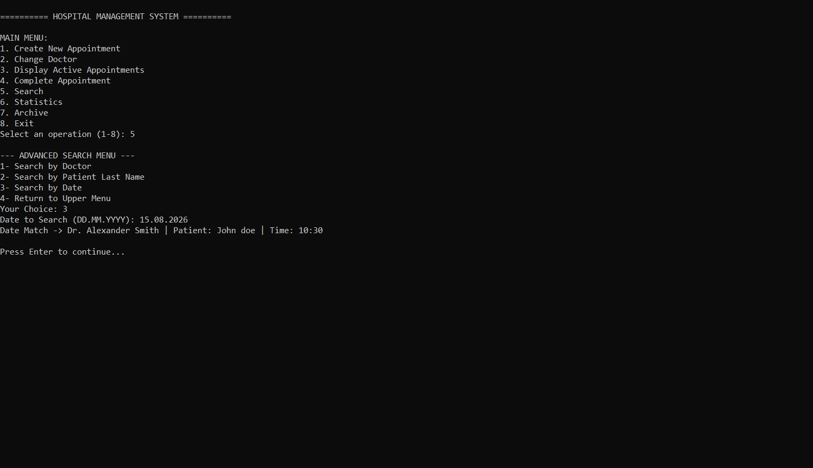
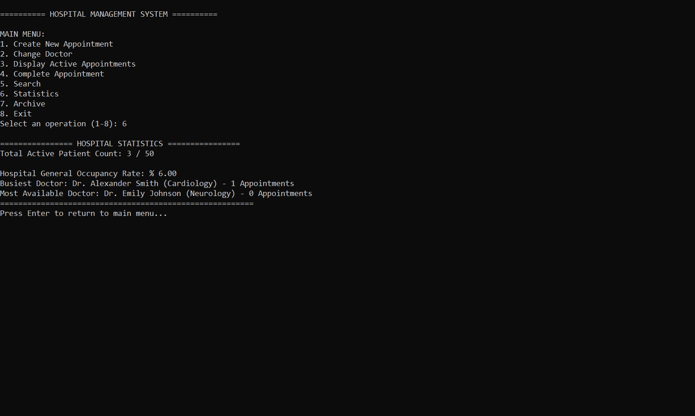
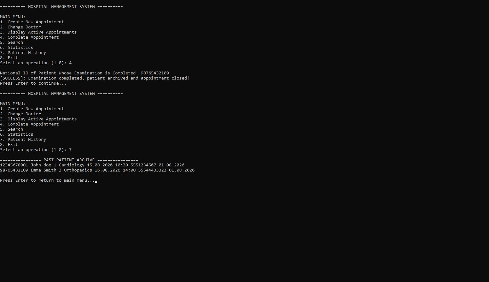

# Hospital Management System in C

A console-based Hospital Management System developed in C.

This project was created to reinforce my C programming skills learned through both my university coursework and the **C Programming with Linux** Specialization offered by **Dartmouth College** and **Institut Mines-Télécom** on Coursera.

The application allows users to manage hospital appointments, store patient information, search records, display statistics, and save data using files.

## Features

- Create new patient appointments
- Change doctor or department appointments
- Display active appointments
- Complete appointments and save patient history
- Search appointments by doctor
- Search appointments by patient last name
- Search appointments by appointment date
- Display hospital statistics
- Prevent duplicate patient appointments
- Prevent appointment time conflicts
- Save and load data using files

## Technologies Used

- C
- GCC
- Structures
- Functions
- Arrays
- File Handling

## Project Structure

```text
Hospital-Management-System-C/
├── main.c
├── README.md
├── LICENSE
└── screenshots/
    ├── main-menu.png
    ├── create-appointment.png
    ├── active-appointments.png
    ├── search-by-date.png
    ├── statistics.png
    └── patient-history.png
```

## How to Run

Compile the program:

```bash
gcc main.c -o hospital
```

Run on Linux

```bash
./hospital
```

Run on Windows

```bash
hospital.exe
```

## Screenshots

### Main Menu



### Create Appointment



### Active Appointments



### Search by Date



### Hospital Statistics



### Patient History



## Related Learning

This project was developed while practicing the concepts learned in the **C Programming with Linux** Specialization offered by **Dartmouth College** and **Institut Mines-Télécom** on Coursera.

**Coursera Certificate:**

https://coursera.org/verify/specialization/ADH5RTNRGOX3

## Author

Silva Ibrahim

Computer Engineering Student

## License

This project is licensed under the MIT License.